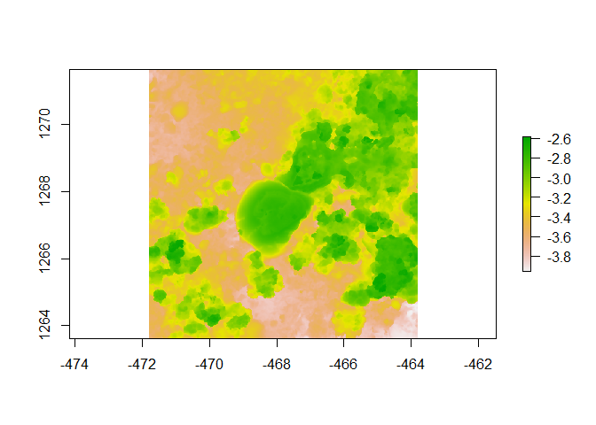

Assignment
================
Jake Snyder
2023-08-22

``` r
knitr::opts_chunk$set(echo=TRUE)
```

``` r
library(devtools)
```

    ## Loading required package: usethis

``` r
library(raster)
```

    ## Loading required package: sp

    ## The legacy packages maptools, rgdal, and rgeos, underpinning the sp package,
    ## which was just loaded, will retire in October 2023.
    ## Please refer to R-spatial evolution reports for details, especially
    ## https://r-spatial.org/r/2023/05/15/evolution4.html.
    ## It may be desirable to make the sf package available;
    ## package maintainers should consider adding sf to Suggests:.
    ## The sp package is now running under evolution status 2
    ##      (status 2 uses the sf package in place of rgdal)

``` r
library(habtools)
```

    ## 
    ## Attaching package: 'habtools'

    ## The following object is masked from 'package:raster':
    ## 
    ##     extent

``` r
library(ggplot2)
library(dplyr)
```

    ## 
    ## Attaching package: 'dplyr'

    ## The following objects are masked from 'package:raster':
    ## 
    ##     intersect, select, union

    ## The following objects are masked from 'package:stats':
    ## 
    ##     filter, lag

    ## The following objects are masked from 'package:base':
    ## 
    ##     intersect, setdiff, setequal, union

``` r
library(fishualize)

plot(horseshoe)
```

    ## Warning in sp::CRS(...): sf required for evolution_status==2L

    ## Warning in sp::CRS(...): sf required for evolution_status==2L

<!-- -->

### Current lab:

Dr. Lisa McManus’ Marine Ecological Theory Lab

### Project focus:

Modeling the effect of sedimentation on herbivorous fish behavior and
feeding and their implications in coral-algal phase shifts.

### Why I chose this course:

This course connects organism traits with ecosystem functions, which is
a central theme in my Ph.D. research. Additionally, MBIO640 teaches
necessary skills that will apply to my future project, such as
collecting field data to parameterize models and analyze in R.

### What do you want to learn about the most in this course:

I want to learn about 3D modeling the most, specifically laser scanning
and 3D printing. I am also excited for the “Functions” module, which
seems to bridge geometry and allometry with ecosystem functions.

### Your R experience:

Beginner-intermediate. I have had two modeling-heavy internships: one
primarily in R, and one in MatLab.

### Fun fact:

I graduated from my undergraduate institution, Penn State, with a minor
in art.
